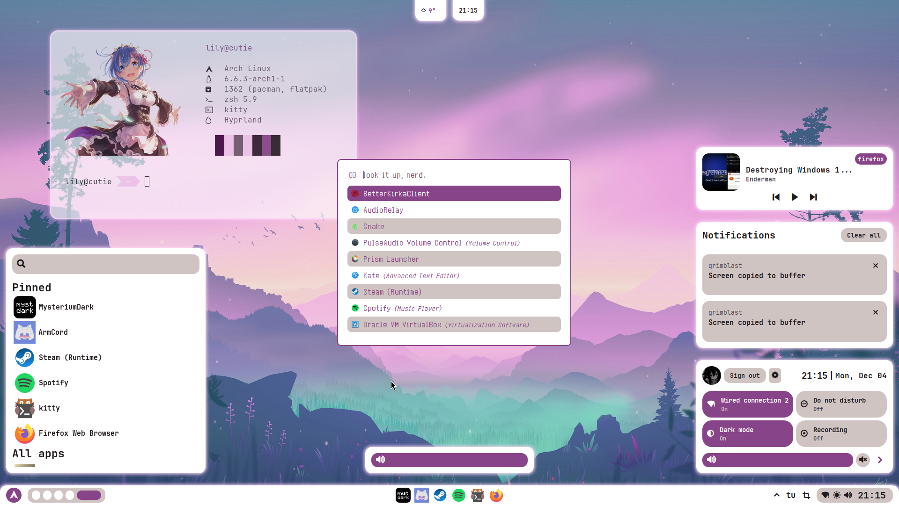
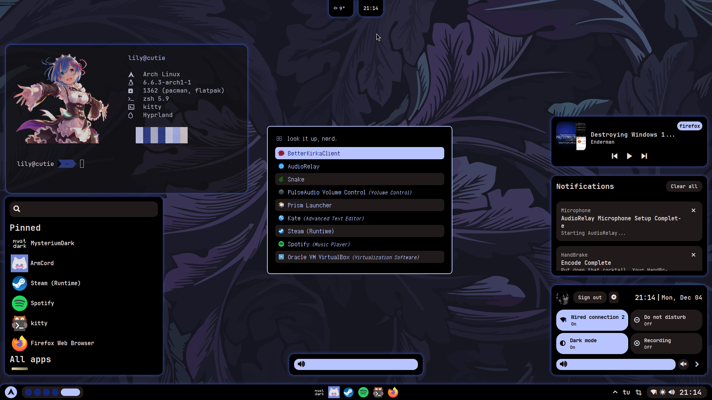
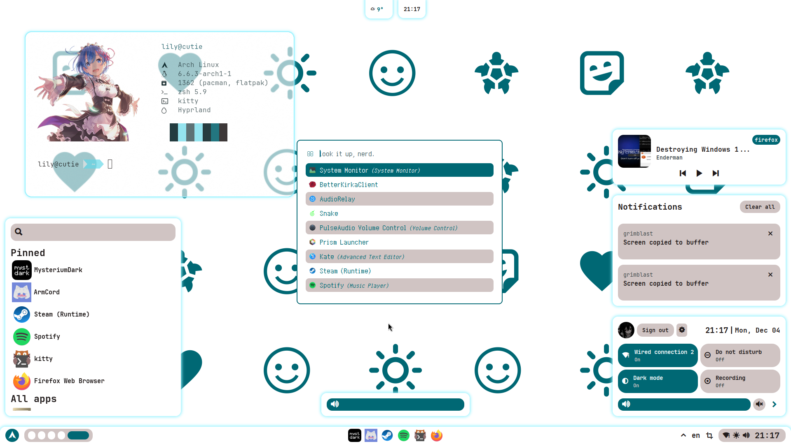
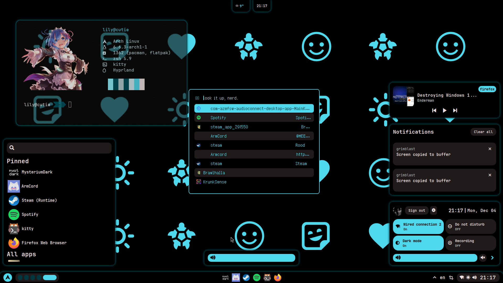

# this repository will never be updated. this is my full personal rice + configuration as of December 4th 2023.
plus this is purely for arch linux + hyprland so idk if the other shit will work for yall

# Features
- **Dynamic**: autogenerated material colors based on your wallpaper
- **Dark and light theme**: just toggle button in control center
- **Control center**: quick access to everything you need (probably)
- **Notifications**: notification daemon written on python with notifications center
- **Launcher**: you can pin and unpin apps, just right click on them
- **Generative**: i didnt know how to describe this one lmao basically it can make wallpapers for you (see images 3 and 4 in Gallery)

# Gallery

## Installation
- See the [Installation Page](https://github.com/femgore/dotfiles/wiki/Installation)
## Keybindings
- See the [Cheat Sheet](https://github.com/femgore/dotfiles/wiki/Cheat-Sheet)
